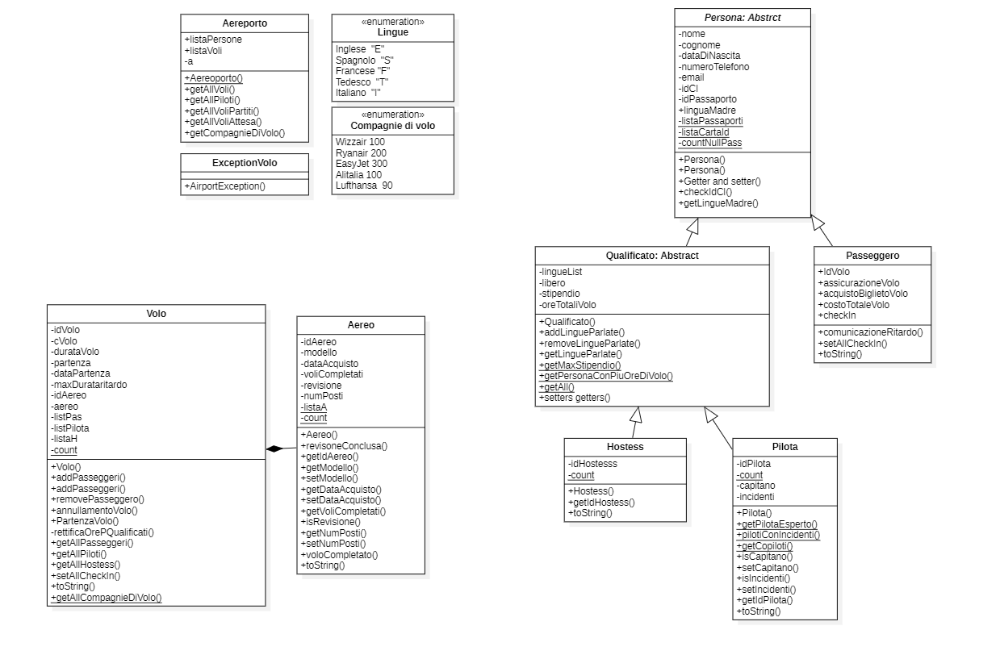
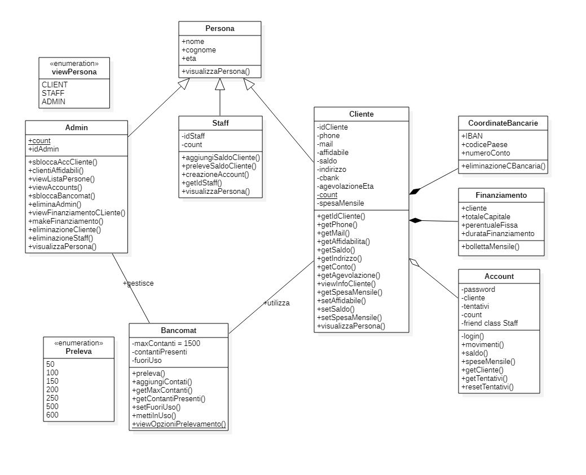

# Advanced-programming
Java, C/C++ and haskell projects

# Java project: bank management
Java constructs used:
<div align="center">

&bull; Exceptions &bull; Final &bull; Static &bull; Getters / Setters &bull; Lambda Functions &bull; Enum &bull; Overload &bull; Override <br> &bull; Accessibility Modifiers &bull; Abstract <br> &bull; Facade Pattern &bull; Singleton Pattern &bull; Iterators &bull; Generic Methods &bull; Inheritance &bull; Varargs &bull; Java Collections Framework &rarr; List


</div>


<p align="center">
  
</p>


# C++ project
C++ constructs used:
<div align="center">

&bull; Inheritance &bull; Constructors/destructors &bull; Static variables and methods &bull; Usage of const &bull; Iterators &bull; Delete/free &bull; New/malloc &bull; Overload <br> &bull; Override, virtual, override &bull; Friend constructor &bull; Enum and casting &bull; Accessibility modifiers &bull; Interface and implementation separation &bull; Final <br> &bull; Constants &bull; Exceptions &bull; Smart pointers &bull; List initializer &bull; Function Template &bull; Default parameter &bull; Foreach &bull; Containers &rarr; `vector<T>`

</div>


<p align="center">
  
</p>
  
Use this command line in order to execute the code:
```
g++ Main.cpp .\Account.cpp .\Admin.cpp .\Bancomat.cpp .\Cliente.cpp .\CoordinateBancarie.cpp .\Finanziamento.cpp .\Persona.cpp .\Staff.cpp
```

# Haskell project: bank management
Haskell's project gives a list of clients adhering to a banking management system that they are displayed into a list in the form of a tuple. For each
customer/tuple are stored: identifier, customer name and balance. Furthermore there are functions that operate and manipulate the clients list in oder to excute different operations. 

```
 client = (ID, nome, saldo) = (int, String, int)
 clients = [(1, "Marcello", 1000), (2, "Martina", 500), (3, "Leonardo", 1500), (4, "Giovanni", 2000)]
```
